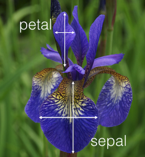
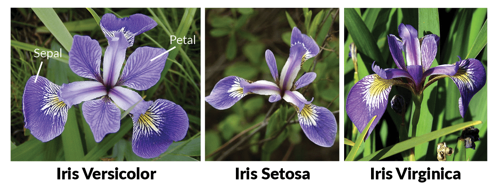
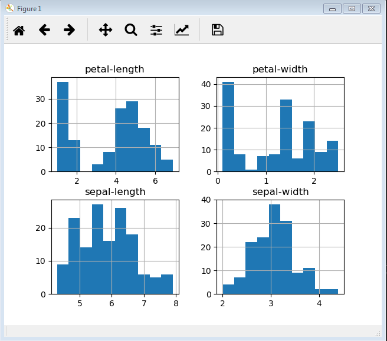

# FinalProject

## List Things to do 

1. Who is Ronald Fisher
2. What is the Iris Dataset
3. How was the data collected
4. Some interesting Facts about the dataset
5. How Many rows are in the dataset
6. Python code to Calculate Max, Min and mean of each column of the dataset.
7. Add a graph
8. How to execute the python code.
9. Summary of my findings

## 1 Who is Ronald Fisher

This is an image of Ronald Fisher

###Biography

#### Referance :-https://study.com/academy/lesson/sir-ronald-fisher-biography-contributions-to-statistics.html
Touted as the greatest scientist of his time, Sir Ronald Fisher (1890-1962) was a British statistician and biologist who was known for his contributions to experimental design and population genetics. He is known as the father of modern statistics and experimental design.

Sir Ronald Aylmer Fisher was born into a wealthy family in London, England on 17 February, 1890. He studied at Harrow School in Hampstead. He was among the brightest students of the school. When he turned 15, his father's business went bankrupt and the family had to move to Streatham.
He suffered from extreme shortsightedness. He was not even allowed to study under an electric lamp as it strained his eyes. This proved to be a blessing in disguise, as he learned to visualize mathematical problems in his head and solve them mentally. He did not let it put him down in any way.
At the age of 19, he won a scholarship to the University of Cambridge, where he studied mathematics and graduated in 1912 with a first class honors in mathematics. After graduating, he stayed at Cambridge to study postgraduate level physics, including the theory of errors, which increased his interest in statistics.
Fisher was always interested in the field of evolution and genetics. He maintained a strong interest in eugenics, which is the science involving improvement of human species by selective breeding. In 1911, he formed a Eugenics Society in Cambridge University, which attracted a number of prominent members.
He started working as a statistician at an insurance company in 1913. After a brief stint there, he became a high school teacher and continued his research in statistics. In 1919, he started working with Rothamsted Experimental Station in agricultural research. The access to huge amounts of agricultural data here helped him in devising new theories on experiments.
Thus, his early experiences in the University of Cambridge shaped his interest in the field of population genetics. He was known as the best biologist since Charles Darwin. He published 7 books and almost 400 academic research papers in the fields of statistics and genetics.
Fisher suffered from colon cancer and died aged 72 on July 29, 1962, in Adelaide, Australia following a surgery for the same. He was cremated in St. Peter's Cathedral, Adelaide.
Now, we will have a look at his most noteworthy contributions to statistics.

## 2 What is the Iris Dataset

#### Referance :- https://www.ritchieng.com/machine-learning-iris-dataset/
The iris dataset contains the following data
50 samples of 3 different species of iris (150 samples total)
Measurements: sepal length, sepal width, petal length, petal width
The format for the data: (sepal length, sepal width, petal length, petal width)

## 3 How was the data collected

#### Referance :-https://en.wikipedia.org/wiki/Iris_flower_data_set

It is sometimes called Anderson's Iris data set because Edgar Anderson collected the data to quantify the morphologic variation of Iris flowers of three related species.Two of the three species were collected in the Gaspé Peninsula "all from the same pasture, and picked on the same day and measured at the same time by the same person with the same apparatus" it was collected  collected in Hawaii

## 4 Some interesting Facts about the dataset

#### Referance :-https://stats.stackexchange.com/questions/74776/what-aspects-of-the-iris-data-set-make-it-so-successful-as-an-example-teaching
The data was used by the celebrated British statistician Ronald Fisher in 1936. (Later he was knighted and became Sir Ronald.) At least some teachers like the idea of a dataset with a link to someone so well known within the field. The data were originally published by the statistically-minded botanist Edgar S. Anderson, but that earlier origin does not diminish the association.

## 5 How Many rows are in the dataset

#### Referance :- https://www.kaggle.com/lalitharajesh/iris-dataset-exploratory-data-analysis
I found this out by importing a few libraries and then reading in the dataset from a CSV file (FisherDS.csv) stored on my Laptop.
I used the python code below and displayed the number of rows using print(dataset.shape).
the out come was **150** rows and it also gave me the information of columns **5** in our case *(['sepal-length', 'sepal-width', 'petal-length', 'petal-width', 'species'])*

In [2]: import csv

In [3]:  import pandas

In [4]:  import matplotlib.pyplot as plt

In [5]: url = "FisherDS.csv"

In [6]: names = ['sepal-length', 'sepal-width', 'petal-length', 'petal-width', 'species']

In [7]: dataset = pandas.read_csv(url, names=names)

In [8]: print(dataset.shape)
(150, 5)

## 6 Python code to Calculate Max, Min and mean of each column of the dataset.

#### Referance :- https://pandas.pydata.org/pandas-docs/stable/getting_started/10min.html

### Mean
I used the following code to calculate the mean of each column:-
##### import the required library
**import csv,**
**pandas as pd,**
**import matplotlib.pyplot as plt**

##### create a dotted line seperator for visual effect
**def print_dotted_line():**
    **print('\n','-'*80,'\n')**

##### import the csv and read in to panda
**url = "FisherDS.csv"**
**names = ['sepal-length', 'sepal-width', 'petal-length', 'petal-width', 'species']**
**dataset = pd.read_csv(url, names=names)**

##### get the mean of each column
**print(dataset.mean())**

Output:-

*sepal-length    5.843333,*
*sepal-width     3.054000,*
*petal-length    3.758667,*
*petal-width     1.198667*

### Max

Code:-
**print(dataset.max())**

Output:-

*sepal-length     7.9*
*sepal-width      4.4*
*petal-length     6.9*
*petal-width      2.5*

### Min

Code:-
**print(dataset.min())**

Output:-

*sepal-length       4.3*
*sepal-width          2*
*petal-length         1*
*petal-width        0.1*

## 7 Add a graph

#### Histograms
*dataset.hist()*
*plt.show()*

## 8 How to execute the python code.

1. Enter Iris-Fisher.py followed by 1 for MEAN
2. Enter Iris-Fisher.py followed by 2 for MAX
3. Enter Iris-Fisher.py followed by 3 for MIN
4. Enter Iris-Fisher.py followed by 4 for Number of rows and columns
5. Enter Iris-Fisher.py followed by 5 for Histogram
6. Get the mean of petal-length grouped by Species

## 9 Summary of my findings

